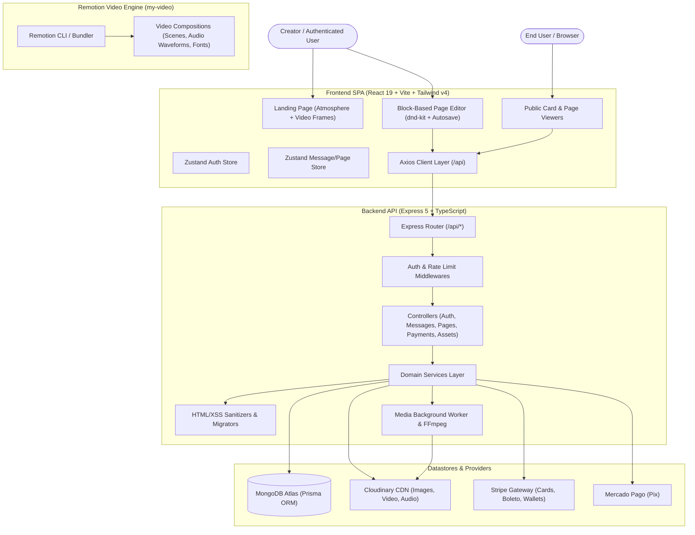
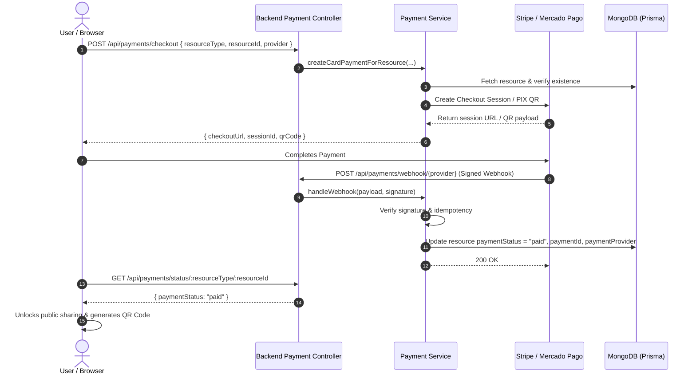

# Correio Elegante — Architecture Blueprint (ARCHITECTURE.md)

Version: `1.0.0`  
Status: `Living Architecture Reference`

---

## 1. High-Level System Architecture



---

## 2. Frontend Layered Architecture (`frontend/src/`)

```
frontend/src/
├── app/                  # Application routing, layout wrappers, and providers
│   └── router.tsx        # React Router routes with lazy-loaded page chunks
├── components/           # Reusable presentational & layout components
│   ├── animations/       # Canvas 2D hero frames, atmospheric particles, bokeh
│   ├── layout/           # Header, Footer, navigation, SmoothScroll (Lenis)
│   ├── sections/         # Landing page marketing & storytelling sections
│   └── ui/               # Design system primitives (Button, Modal, Card, Input)
├── editor/               # Block editor subsystem
│   ├── blocks/           # Individual block components (Text, Media, Music, Gallery, Timer)
│   ├── components/       # Toolbar, canvas, sortable wrapper, media selector
│   ├── state/            # Editor state store, debounced local draft persistence
│   └── types.ts          # Core block union types and interfaces
├── hooks/                # Custom React hooks (audio visualizer, mouse, parallax)
├── pages/                # Route view components (Home, Create, Editor, Card, Profile, Payment)
├── services/             # HTTP service layer with Axios interceptors & auto-refresh
└── store/                # Global Zustand stores (authStore, messageStore)
```

### Key Frontend Design Patterns
1. **Event-Driven Hero Animation**: The landing page uses Canvas 2D WebP frame caching (`HeroVideo.tsx`) with scroll progression mapped via GSAP and Lenis.
2. **Optimistic & Debounced Drafting**: The editor automatically preserves changes to `localStorage` with a 300ms debounce while tracking dirty/saving state to avoid unnecessary network pressure.
3. **Lazy Subsystem Loading**: Heavy views (Editor, Payment, Auth, Video) are code-split into distinct chunks (`React.lazy`), maintaining a bundle size under 220kB for initial landing load.

---

## 3. Backend Layered Architecture (`backend/src/`)

```
backend/src/
├── __tests__/            # Integration & unit test suites (Vitest + Supertest)
├── config/               # Environment variables, feature flags, CORS config
├── constants/            # System constants, legal doc versions
├── contracts/            # Domain contracts, lifecycle state helpers
├── controllers/          # HTTP request handlers (thin translation layer)
├── middlewares/          # Auth, validation, rate limiting, error handling
├── routes/               # Express route groups (/api/auth, /api/pages, /api/payments, etc.)
├── services/             # Pure business logic & 3rd party SDK wrappers
├── utils/                # Prisma client singleton, JWT utils, AppError, logger
├── app.ts                # Express app setup and middleware pipeline
└── server.ts             # Process startup & graceful shutdown
```

### Request Lifecycle Pipeline
```
[Inbound HTTP Request]
       │
       ▼
[Helmet & Security Headers]
       │
       ▼
[CORS Middleware (Allowed Origins)]
       │
       ▼
[Cookie Parser & Body Parser]
       │
       ▼
[Rate Limiter]
       │
       ▼
[Optional / Required JWT Authenticate Middleware]
       │
       ▼
[Zod Schema Validator Middleware]
       │
       ▼
[Controller Handler]
       │
       ▼
[Domain Service Layer]
       │
       ▼
[Prisma ORM -> MongoDB Atlas]
       │
       ▼
[Standardized JSON Response] (or thrown AppError -> errorHandler middleware)
```

---

## 4. Payment & Order Fulfillment Pipeline



---

## 5. Media Ingestion & Background Job Pipeline

1. **Direct Upload Authorization**: Client requests upload URL via `POST /api/assets/upload-url`. Backend verifies size limits, mime types, and returns signed Cloudinary upload params.
2. **Direct Storage Upload**: Browser uploads binary payload directly to Cloudinary CDN, bypassing server memory/bandwidth limits.
3. **Upload Confirmation**: Client calls `POST /api/assets/complete`. Backend marks asset `processing` and enqueues relevant `MediaJob` records (e.g. `waveform_generation`, `video_transcode`, `moderation`).
4. **Worker Processing**: `mediaWorker.service.ts` processes pending jobs asynchronously, updates asset waveforms/posterUrls, and transitions status to `completed`.

---

## 6. Video Generation Architecture (`my-video/`)

- Built with **Remotion 4** and **Tailwind v4**.
- Renders programmatic MP4 videos from letter messages with styled dynamic text typography, heart particle animations, audio waveform sync, and background gradient motion.
- Invoked locally or in CI/server workers via `npx remotion render src/index.ts LetterVideo out/letter.mp4 --props='{...}'`.
