<!-- BANNER ANIMADO -->
<p align="center">
  
</p>

<!-- TECH BADGES MINIMALISTAS -->
<p align="center">
  
  
  
  
  
  
  
  
</p>

---

## Visão Geral

O **Correio Elegante** é uma plataforma digital e interativa para envio de mensagens e cartões virtuais temáticos de alta fidelidade visual. O projeto combina animações fluidas baseadas em física e transições dinâmicas (Framer Motion, GSAP, Lenis) com um backend robusto integrado a gateways reais de pagamento (Mercado Pago para Pix e Stripe para Cartão de Crédito). O fluxo garante que a mensagem do remetente só seja disponibilizada para leitura e compartilhamento (via link público ou QR Code) após a confirmação automática do pagamento.

---

## Demonstração Visual

Abaixo está o layout das principais telas da aplicação em dispositivos móveis e desktops, demonstrando o design focado em responsividade e estética premium:

| Interface Desktop | Interface Mobile |
| :--- | :--- |
|  |  |
|  |  |

---

## Arquitetura de Fluxo de Dados

A imagem abaixo ilustra a integração contínua do ecossistema desde a criação da carta pelo usuário até a entrega final por meio de webhooks de pagamento assíncronos:

<p align="center">
  
</p>

### Ciclo de Vida da Carta Digital

1. **Customização & Escrita**: O remetente cria a mensagem no editor visual do frontend, personaliza os temas estéticos (cores, layouts e fontes) e anexa trilhas sonoras ou mídias (armazenadas em nuvem via Cloudinary).
2. **Registro & Intenção de Pagamento**: A API Express valida os dados estruturados com esquemas do Zod, cria um registro temporário inativo da carta no banco de dados MongoDB Atlas (gerenciado pelo Prisma ORM) e solicita a criação da sessão de checkout no Stripe ou a cobrança Pix no Mercado Pago.
3. **Pagamento Seguro**: O cliente é direcionado para a interface oficial do gateway escolhido para efetuar a transação de forma totalmente segura.
4. **Confirmação e Webhook**: Ao compensar o pagamento, o gateway envia uma notificação HTTP POST (Webhook) em segundo plano para o backend. A API valida a assinatura do webhook, ativa a carta no banco de dados e gera a URL pública de compartilhamento.
5. **Entrega**: O remetente acessa o QR Code dinâmico ou copia o link para enviar ao destinatário. Ao abrir o link, a carta é renderizada com as transições visuais e efeitos sonoros configurados pelo remetente.

---

## Detalhes Tecnológicos por Módulo

A tabela a seguir descreve a responsabilidade técnica e o conjunto de bibliotecas de cada módulo do monorepo:

| Módulo / Componente | Tecnologias Utilizadas | Papel no Sistema |
| :--- | :--- | :--- |
| **Frontend Web App** | React 19, Vite, Tailwind CSS v4, Zustand, Framer Motion, GSAP, Lenis | Single Page Application responsiva (Mobile First) que implementa um editor de mensagens rico, animações com física de amortecimento (Framer Motion) e scroll suave. |
| **Backend API Server** | Node.js, Express 5, TypeScript, JWT, Cookie Parser | API RESTful protegida responsável por autenticação de contas, criação de sessões de checkout, validação de requisições com Zod e processamento de webhooks com segurança de criptografia de assinatura. |
| **Banco de Dados** | MongoDB Atlas, Prisma Client | Persistência de documentos (esquemas User e Message) de forma assíncrona, facilitada por modelagem tipada via Prisma Schema. |
| **Provedores de Pagamento** | Stripe SDK, Mercado Pago API | Gateway duplo oferecendo Pix (com QR code dinâmico e código "copia e cola" com expiração configurada) e cartões de crédito internacionais. |
| **Armazenamento de Mídia** | Cloudinary SDK | Upload e otimização automatizada de mídias enviadas pelos usuários durante a customização da carta. |

---

## Como Iniciar o Projeto Localmente

### Pré-requisitos
* **Node.js** (versão 18 ou superior)
* Acesso às chaves de desenvolvimento dos serviços de terceiros (MongoDB, Stripe, Mercado Pago e Cloudinary)

<details>
<summary><b>1. Clonar e Instalar Dependências</b></summary>
<br />

Execute a instalação dos pacotes diretamente da raiz do monorepo para ambas as aplicações:

```bash
# Instala as dependências de orquestração do monorepo
npm install

# Instala as dependências do Frontend e Backend
npm install --prefix frontend
npm install --prefix backend
```
</details>

<details>
<summary><b>2. Configurar Variáveis de Ambiente</b></summary>
<br />

Crie as configurações de ambiente para o servidor de API:

```bash
cd backend
cp .env.example .env
```

Abra o arquivo `backend/.env` e insira suas credenciais:

| Variável | Descrição |
| :--- | :--- |
| `PORT` | Porta de escuta da API (padrão: 3001) |
| `NODE_ENV` | Define o ambiente (`development` ou `production`) |
| `FRONTEND_URL` | URL de origem permitida para CORS (ex: `http://localhost:5173`) |
| `DATABASE_URL` | String de conexão MongoDB Atlas |
| `JWT_SECRET` | Chave de assinatura para tokens de acesso JWT |
| `JWT_REFRESH_SECRET` | Chave de assinatura para tokens de renovação JWT |
| `CLOUDINARY_CLOUD_NAME` | Nome do cloud storage do Cloudinary |
| `CLOUDINARY_API_KEY` | API Key do Cloudinary |
| `CLOUDINARY_API_SECRET` | API Secret do Cloudinary |
| `STRIPE_SECRET_KEY` | Chave secreta de teste do Stripe (`sk_test_...`) |
| `STRIPE_WEBHOOK_SECRET` | Segredo de validação de assinatura de webhooks do Stripe |
| `MP_ACCESS_TOKEN` | Token de acesso para a API do Mercado Pago |
| `MP_PUBLIC_KEY` | Chave pública da API do Mercado Pago |
</details>

<details>
<summary><b>3. Inicializar Modelagem de Dados (Prisma)</b></summary>
<br />

Gere o cliente de tipos do Prisma no diretório do backend:

```bash
cd backend
npm run prisma:generate
```
</details>

<details>
<summary><b>4. Executar em Desenvolvimento</b></summary>
<br />

Para rodar simultaneamente o backend e o frontend com auto-reload ativado em ambos:

```bash
# Execute a partir da raiz do repositório
npm run all
```

Após a inicialização:
* **Frontend SPA**: `http://localhost:5173`
* **Backend API**: `http://localhost:3001`
</details>

---

## Estrutura de Pastas Principal

```path
correioelegante3/
├── frontend/          # SPA React com editor de cartas e animações premium
│   ├── src/
│   │   ├── app/       # Roteamento central e inicializadores de contexto
│   │   ├── components/# Componentes visuais comuns (layout, UI e efeitos)
│   │   ├── editor/    # Módulos específicos do painel de customização
│   │   ├── services/  # Camada de comunicação HTTP baseada em Axios
│   │   └── store/     # Gerenciamento de estados globais com Zustand
├── backend/           # API Rest em Express e esquemas do Prisma
│   ├── prisma/        # Schema de dados relacionais e coleções do MongoDB
│   ├── src/
│   │   ├── controllers/# Lógica de validação e controle de rotas
│   │   ├── middlewares/# Interceptadores de segurança, tokens e erros
│   │   ├── routes/    # Mapeamento dos endpoints expostos da API
│   │   └── services/  # Regras de negócio e adaptadores de gateways
└── docs/              # Elementos gráficos da documentação
    ├── banner.svg     # Banner animado principal
    └── architecture.svg# Diagrama de fluxo e arquitetura
```

---

## Licença

Este projeto está sob os termos da [Licença MIT](LICENSE). É livre para estudo, distribuição e uso.
