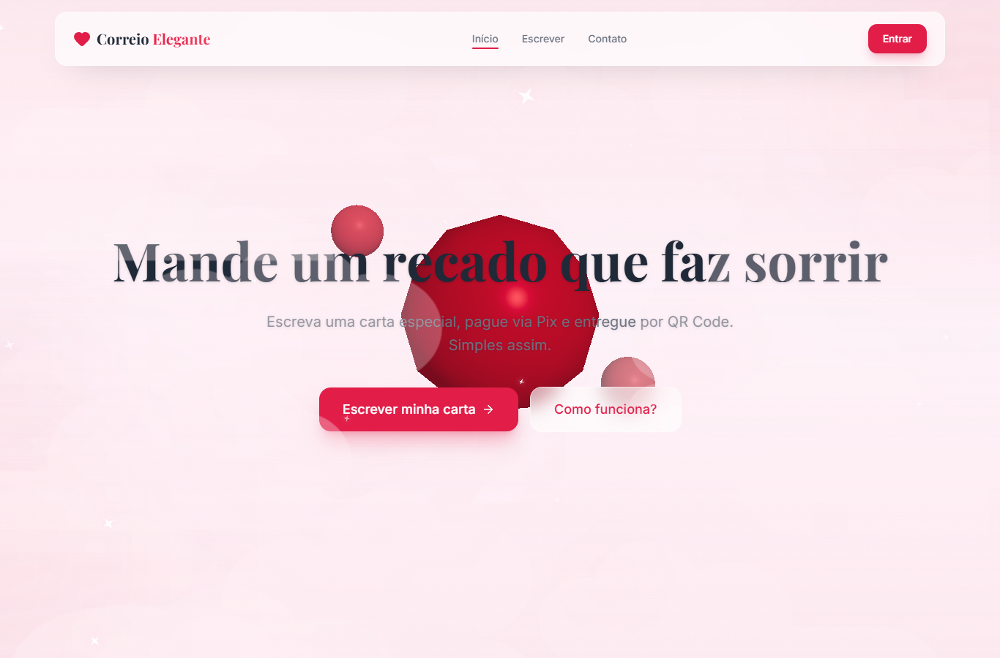
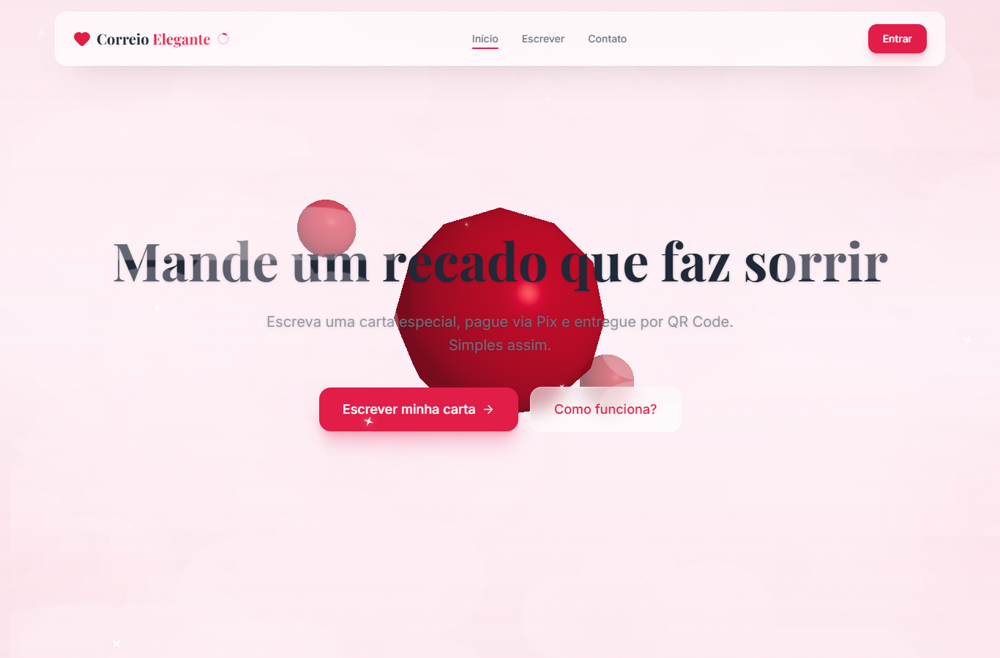

<div align="center">
  <a href="#correio-elegante"></a>
</div>

> 🇧🇷 [Versão em Português](docs/README.pt-BR.md)

<table width="100%">
  <tr>
    <td width="50%" valign="top">
      <pre lang="text"><code>CORREIO ELEGANTE · postal dispatch
------------------------------------------------
item     : interactive digital letter
editor   : 11 block types, drag-and-drop
music    : vinyl/cassette + synced lyrics
seal     : wax-sealed envelope unboxing
price    : pix R$4.99 · card · R$15/mo plan
delivery : public link or QR code</code></pre>
    </td>
    <td width="50%" valign="top">
      <pre lang="python"><code>class CorreioElegante:
    frontend = ["react 19", "vite 7", "tailwind v4",
                "zustand", "framer motion", "dnd-kit"]
    backend  = ["express 5", "prisma 6", "mongodb",
                "stripe", "pagbank v3", "resend"]
    video    = "remotion 4 · 1920x1080 @ 30fps"
    deploy   = "vercel · correioelegante.studio"</code></pre>
    </td>
  </tr>
</table>

### ❯ badges

<p align="left">
  
  
  
  
  
  
  
  
  
  
</p>

---

### ❯ what_it_is

Correio Elegante is a paid digital letter service. The sender writes in a block
editor (text, photos, a soundtrack with synced lyrics, quizzes, countdowns),
seals the result inside a wax-stamped envelope animation, and pays per letter or
on a monthly plan. The letter stays locked until the payment webhook clears it;
delivery is a shareable link or QR code that opens the full unboxing sequence
for the recipient. Live at `correioelegante.studio`.

The repo is an unhoisted monorepo: a React SPA, an Express API, a Remotion
video workspace, and a Vercel serverless entrypoint that mounts the API under
`/api/*` on the same domain.

---

### ❯ the_letter_journey

<div align="center">
  
</div>

1. **Compose**: the sender builds the letter in the React editor: blocks, theme,
   soundtrack, and media uploads (stored on Cloudinary, transcoded by an FFmpeg
   worker for heavy files).
2. **Checkout**: the Express API validates the payload with Zod, saves the
   letter as inactive in MongoDB Atlas via Prisma, and opens a payment: PagBank
   V3 for Pix or transparent card, Stripe Checkout for card.
3. **Pay**: the sender finishes on the gateway's page or scans the Pix QR code
   (EMV copia-e-cola payload plus hosted PNG, 30-minute expiry by default).
4. **Webhook**: the gateway posts back; the API verifies the signature, flips
   the letter to active, and issues the public URL.
5. **Deliver**: link or QR code. The recipient gets the wax-seal unboxing, the
   soundtrack, and every block exactly as designed.

---

### ❯ the_editor

- 11 block types: `text`, `image`, `gallery`, `polaroid`, `music`, `video`,
  `envelope`, `timer`, `timeline`, `quiz`, `scratch` (a scratch-off secret
  panel). Schema versioned with forward migration (`frontend/src/editor/`).
- Drag-and-drop sorting via dnd-kit, autosave drafts, and edit/preview modes.
- The `music` block pulls synced lyrics from LRCLIB and plays them through
  vinyl or cassette deck skins (`SyncedLyricsView`, `VinylRecord`,
  `VintagePlayerDeck`).
- Motion is Framer Motion plus Lenis smooth scroll and Lottie accents; the
  envelope unboxing is a hand-rolled animation sequence, no WebGL.
- Strict light theme across the product: paper background, rose primary, deep
  wine text, gold accents. Typography: Playfair Display, Inter, Dancing Script.

---

### ❯ payments

- **Pix** runs on the PagBank V3 Orders API. The response carries the EMV
  copia-e-cola string, a hosted QR code PNG URL, and the expiration timestamp.
- **Card** runs on Stripe Checkout (hosted session) or PagBank transparent
  checkout with a client-side encrypted card payload.
- **Subscription**: R$ 15/month plan for repeat senders, via PagBank Pix or
  Stripe card (`POST /api/payments/subscription/checkout`).
- **Mercado Pago is deactivated.** The SDK was removed over CVE exposure; the
  service file is a documented no-op kept for legacy pending payments, with a
  four-step re-enable procedure in `backend/src/services/mercadopago.service.ts`.
- Webhooks verify signatures before anything unlocks
  (`/api/payments/webhook/pagbank`, Stripe). Cloudflare Turnstile gates checkout
  creation; auth endpoints are rate limited at 10 requests per minute per IP.

---

### ❯ stack

| module | stack | job |
| :--- | :--- | :--- |
| `frontend/` | React 19.2, Vite 7, TypeScript 5.9, Tailwind CSS v4, Zustand, Framer Motion, dnd-kit, Lenis, Lottie, qrcode.react | SPA: landing, editor, public letter viewer |
| `backend/` | Express 5.1, Prisma 6.5, MongoDB Atlas, Zod, JWT, bcryptjs, helmet, express-rate-limit | REST API: auth, letters, payments, webhooks |
| media pipeline | Cloudinary, Multer, FFmpeg/ffprobe worker | user uploads, transcode + poster jobs |
| comms | Resend, Cloudflare Turnstile | transactional email, bot protection |
| `my-video/` | Remotion 4.0, React 19, Tailwind v4 | 90-second product film, 1920×1080 @ 30 fps |
| `api/` | @vercel/node | serverless wrapper mounting the Express app |
| tests | Vitest 4, Supertest, jsdom | unit and integration suites in every workspace |

---

### ❯ screenshots

<table width="100%">
  <tr>
    <td width="68%" valign="top"><sub>hero · desktop</sub><br/></td>
    <td width="32%" valign="top"><sub>hero · mobile</sub><br/></td>
  </tr>
  <tr>
    <td valign="top"><sub>after scroll · desktop</sub><br/></td>
    <td valign="top"><sub>after scroll · mobile</sub><br/></td>
  </tr>
</table>

---

### ❯ setup

Prerequisites: Node 18+, a MongoDB Atlas connection string (replica set, needed
for Prisma transactions), and sandbox keys for Stripe, PagBank, Cloudinary,
Resend, and Turnstile.

```bash
npm install
npm install --prefix frontend
npm install --prefix backend
npm install --prefix my-video   # only if you touch the video workspace

cp backend/.env.example backend/.env   # then fill in the keys
npm run prisma:generate --prefix backend

npm run dev   # backend :3000 + frontend :5173, via concurrently
```

Essential variables in `backend/.env`:

| variable | unlocks |
| :--- | :--- |
| `DATABASE_URL` | MongoDB Atlas connection |
| `JWT_SECRET` / `JWT_REFRESH_SECRET` | access tokens (15 min) + httpOnly refresh cookie (7 d) |
| `STRIPE_SECRET_KEY` / `STRIPE_WEBHOOK_SECRET` | card checkout + signed webhooks |
| `PAGBANK_TOKEN` / `PAGBANK_PUBLIC_KEY` / `PAGBANK_ENV` | Pix orders + transparent card (`sandbox` first) |
| `CLOUDINARY_URL` | media storage and delivery |
| `TURNSTILE_SECRET` | bot check on checkout endpoints |
| `RESEND_API_KEY` / `EMAIL_FROM` | verification and receipt emails |
| `FRONTEND_URL` | CORS origin and post-payment redirects |

Mercado Pago variables exist in `.env.example` only to support reactivating the
disabled provider; leave them empty otherwise.

Sanity checks before shipping anything:

```bash
npm test          # vitest: frontend + backend
npm run lint      # eslint: frontend + backend + my-video
npm run typecheck # tsc in all three workspaces
npm run build     # production builds
```

---

### ❯ structure

<pre lang="text"><code>correioelegante3/
├── frontend/          React 19 SPA · landing, block editor, public viewer
│   └── src/editor/    block types, themes, autosave, schema migration
├── backend/           Express 5 API · zod-validated routes, domain services
│   ├── prisma/        MongoDB schema (11 models: user, message, page, asset...)
│   └── src/services/  pagbank, stripe, cloudinary, resend, media worker
├── my-video/          Remotion 4 workspace · 90 s product film
├── api/               Vercel serverless entry mounting the Express app
├── docs/              banner + architecture SVGs, landing screenshots
├── graphify-out/      generated codebase knowledge graph (graph.html, report)
├── SPEC.md            API contracts, data models, payment state machine
└── ARCHITECTURE.md    request pipelines and security boundaries</code></pre>

---

### ❯ docs

`SPEC.md` · API contracts and the payment state machine  
`ARCHITECTURE.md` · request pipelines and security boundaries  
`AGENTS.md` · repo rules for coding agents  
`graphify-out/GRAPH_REPORT.md` + `graph.html` · generated codebase graph  
`frontend/README.md` / `my-video/README.md` · per-workspace notes

---

MIT © 2026 Thiago Araújo. See [LICENSE](LICENSE).
